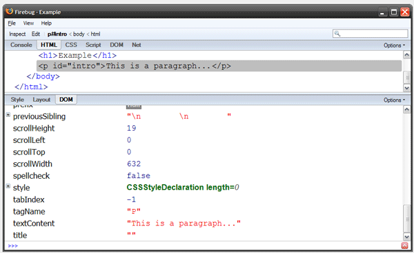
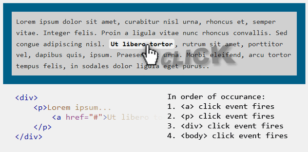

#JavaScript 与 DOM（下）

##介绍

上一章我们介绍了 JavaScript 的基本内容和 DOM 对象的各个方面，包括如何访问 node 节点。本章我们将讲解如何通过 DOM 操作元素并且讨论浏览器事件模型。

##操作元素

上一章节我们提到了 DOM 节点集合或单个节点的访问步骤，每个 DOM 节点都包括一个属性集合，大多数的属性都提供为相应的功能提供了抽象。例如，如果有一个带有 ID 属性 intro 的文本元素，你可以很容易地通过 DOM API 来改变该元素的颜色：

```
document.getElementById('intro').style.color = '#FF0000';
```

为了理解这个 API 的功能，我们一步一步分开来看就非常容易理解了：

```
var myDocument = document;  
var myIntro = myDocument.getElementById('intro');  
var myIntroStyles = myIntro.style;  
// 现在，我们可以设置颜色了:  
myIntroStyles.color = '#FF0000';
```

现在，我们有了该文本的 style 对象的引用了，所以我们可以添加其它的 CSS 样式：

```
myIntroStyles.padding = '2px 3px 0 3px';  
myIntroStyles.backgroundColor = '#FFF';  
myIntroStyles.marginTop = '20px'; 
```

这里我们只是要了基本的 CSS 属性名称，唯一区别是 CSS 属性的名称如果带有-的话，就需要去除，比如用 marginTop 代替 margin-top。例如，下面的代码是不工作的，并且会抛出语法错误：

```
myIntroStyles.padding-top = '10em';     
// 产生语法错误：
// 在JavaScript里横线-是减法操作符
// 而且也没有这样的属性名称
```

属性可以像数组一样访问，所以利用这个知识我们可以创建一个函数来改变任何给定元素的样式：

```
function changeStyle(elem, property, val) {
    elem.style[property] = val; // 使用[]来访问属性
}
// 使用上述的函数：  
var myIntro = document.getElementById('intro'); // 获取intro文本对象
changeStyle(myIntro, 'color', 'red');  
```

这仅仅是个例子，所以该函数也许没什么用，语法上来说，直接用还是会快点，例如（elem.style.color = ‘red’）。除了 style 属性以外，一个节点（或元素）也还有其他很多属性可以操作，如果你使用 Firebug，点击 DOM 选项卡可以看到所有该节点（或元素）的所有属性：



所有的属性都可以通过点标示符来访问（例如：Element.tabIndex）。不是所有的属性都是原始数据类型（strings，numbers，Booleans 等等），sytle 属性也是一个包含自己属性的对象，很多元素的属性都是只读的，也就是说不能修改他们的值。例如，你不能直接修改一个节点的 parentNode 属性，如果你修改只读属性的时候浏览器会抛出错误：例如，抛出错误“setting a property that has only a getter”，只是我们需要注意的。

通常 DOM 操作都是改变原始的内容，这里有几种方式来实现这个，最简单的是使用 innerHTML 属性，例如：

```
var myIntro = document.getElementById('intro');  
// 替换当前的内容
myIntro.innerHTML = 'New content for the <strong>amazing</strong> paragraph!';  
// 添加内容到当前的内容里 
myIntro.innerHTML += '... some more content...';
```

唯一的问题是该方法没在规范里定义，而且在 DOM 规范里也没有定义，如果你不反感的话请继续使用，因为它比我们下面要讨论其它的方法快多了。

###Node节点

通过 DOM API 创建内容的时候需要注意 node 节点的 2 种类型，一种是元素节点，一种是 text 节点，上一章节已经列出了所有的节点类型，这两种需要我们现在特别注意。创建元素可以通过 createElement 方法，而创建 text 节点可以使用 createTextNode，相应代码如下：

```
var myIntro = document.getElementById('intro');  
// 添加内容
var someText = 'This is the text I want to add';  
var textNode = document.createTextNode(someText);  
myIntro.appendChild(textNode);
```

这里我们使用了 appendChild 方法将新 text 节点附件到文本字段，这样做比非标准的 innerHTML 方法显得有点长，但了解这些原理依然很重要，这里有一个使用 DOM 方法的更详细例子：

```
var myIntro = document.getElementById('intro');  
// 添加新连接到文本节点
// 首先，创建新连接元素
var myNewLink = document.createElement('a'); // <a/>  
myNewLink.href = 'http://google.com'; // <a href="http://google.com"/>  
myNewLink.appendChild(document.createTextNode('Visit Google')); 
// <a href="http://google.com">Visit Google</a>  
// 将内容附件到文本节点
myIntro.appendChild(myNewLink);
```

另外 DOM 里还有一个 insertBefore 方法用于再节点前面附件内容，通过 insertBefore 和 appendChild 我们可以实现自己的 insertAfter 函数：

```
// 'Target'是DOM里已经存在的元素
// 'Bullet'是要插入的新元素
function insertAfter(target, bullet) {  
    target.nextSibling ?  
        target.parentNode.insertBefore(bullet, target.nextSibling)  
        : target.parentNode.appendChild(bullet);  
}  
// 使用了3目表达式:  
// 格式：条件?条件为true时的表达式：条件为false时的表达式
```

上面的函数首先检查 target 元素的同级下一个节点是否存在，如果存在就在该节点前面添加 bullet 节点，如果不存在，就说明 target 是最后一个节点了，直接在后面 append 新节点就可以了。DOM API 没有给提供 insertAfter 是因为真的没必要了——我们可以自己创建。

DOM 操作有很多内容，上面你看到的只是其中一部分。

##Event事件

浏览器事件是所有 web 程序的核心，通过这些事件我们定义将要发生的行为，如果在页面里有个按钮，那点击此按钮之前你需要验证表单是否合法，这时候就可以使用 click 事件，下面列出的最标准的事件列表：

注：正如我们上章所说的，DOM 和 JavaScript 语言是 2 个单独的东西，浏览器事件是 DOM API 的一部分，而不是 JavaScript 的一部分。

###鼠标事件


1. ‘mousedown’ – 鼠标设备按下一个元素的时候触发 mousedown 事件。
2. ‘mouseup’ – 鼠标设备从按下的元素上弹起的时候触发 mouseup 事件。
3. ‘click’ – 鼠标点击元素的时候触发 click 事件。
4. ‘dblclick’ – 鼠标双击元素的时候触发 dblclick 事件。
5. ‘mouseover’ – 鼠标移动到某元素上的时候触发 mouseover 事件。
6. ‘mouseout’ – 鼠标从某元素离开的时候触发 mouseout 事件。
7. ‘mousemove’ – 鼠标在某元素上移动但未离开的时候触发 mousemove 事件。

###键盘事件


1. ‘keypress’ – 按键按下的时候触发该事件。
2. ‘keydown’ – 按键按下的时候触发该事件，并且在 keypress 事件之前。
3. ‘keyup’ – 按键松开的时候触发该事件，在 keydown 和 keypress 事件之后。

###表单事件


1. ‘select’ – 文本字段（input, textarea等）的文本被选择的时候触发该事件。
2. ‘change’ – 控件失去 input 焦点的时候触发该事件（或者值被改变的时候）。
3. ‘submit’ – 表单提交的时候触发该事件。
4. ‘reset’ – 表单重置的时候触发该事件。
5. ‘focus’ – 元素获得焦点的时候触发该事件，通常来自鼠标设备或 Tab 导航。
6. ‘blur’ – 元素失去焦点的时候触发该事件，通常来自鼠标设备或 Tab 导航。

###其它事件


1. ‘load’ – 页面加载完毕（包括内容、图片、frame、object）的时候触发该事件。
2. ‘resize’ – 页面大小改变的时候触发该事件（例如浏览器缩放）。
3. ‘scroll’ – 页面滚动的时候触发该事件。
4. ‘unload’ – 从页面或 frame 删除所有内容的时候触发该事件（例如离开一个页面）。

还有很多各种各样的事件，上面展示的事件是我们在 JavaScript 里最常用的事件，有些事件在跨浏览器方面可能有所不同。还有其它浏览器实现的一些属性事件，例如 Gecko 实现的 DOMContentLoaded 或 DOMMouseScroll 等，Gecko 的详细事件列表请查看这里。

###事件处理

我们将了事件，但是还没有将到如何将处理函数和事件管理起来，使用这些事件之前，你首先要注册这些事件句柄，然后描述该事件发生的时候该如何处理，下面的例子展示了一个基本的事件注册模型：

基本事件注册：

```
<!-- HTML -->  
<button id="my-button">Click me!</button>  
```

```
// JavaScript:  
var myElement = document.getElementById('my-button');
// 事件处理句柄:  
function buttonClick() {
    alert('You just clicked the button!');
}
// 注册事件
myElement.onclick = buttonClick; 
```

使用 document.getElementById 命令，通过 ID=my-button 获取该 button 对象，然后创建一个处理函数，随后将该函数赋值给该 DOM 的 onclick 属性。就这么简单！

基本事件注册是非常简单的，在事件名称前面添加前缀 on 作为 DOM 的属性就可以使用了，这是事件处理的基本核心，但下面的代码我不推荐使用：

```
<button onclick="return buttonClick()">Click me!</button>
```

上述 Inline 的事件处理方式不利用页面维护，建议将这些处理函数都封装在单独的 js 文件，原因和CSS样式的一样的。

高级事件注册：

别被标题迷惑了，“高级”不意味着好用，实际上上面讨论的基本事件注册是我们大部分时候用的方式，但有一个限制：不能绑定多个处理函数到一个事件上。这也是我们要讲解该小节原因：

该模型运行你绑定多个处理句柄到一个事件上，也就是说一个事件触发的时候多个函数都可以执行，另外，该模型也可以让你很容易里删除某个已经绑定的句柄。

严格来说，有 2 种不同的模型：W3C 模型和微软模型，除 IE 之外 W3C 模型支持所有的现代浏览器，而微软模型只支持 IE，使用 W3C 模型的代码如下：

```
// 格式：target.addEventListener( type, function, useCapture );  
// 例子:  
var myIntro = document.getElementById('intro');
myIntro.addEventListener('click', introClick, false);
```

使用 IE 模型的代码如下：

```
// 格式: target.attachEvent ( 'on' + type, function );  
// 例子:  
var myIntro = document.getElementById('intro');
myIntro.attachEvent('onclick', introClick);
```

introClick 的代码如下：

```
function introClick() {  
    alert('You clicked the paragraph!');  
}
```

事实上，要做出通用的话，我们可以自定义一个函数以支持跨浏览器：

```
function addEvent(elem, type, fn) {
    if (elem.attachEvent) {
        elem.attachEvent('on' + type, fn);
        return;
    }
    if (elem.addEventListener) {
        elem.addEventListener(type, fn, false);
    }
}
```

该函数首先检查 attachEvent 和 addEventListener 属性，谁可以就用谁，这两种类型的模型都支持删除句柄功能，参考下面的 removeEvent 函数。

```
function removeEvent(elem, type, fn) {
    if (elem.detachEvent) {
        elem.detachEvent('on' + type, fn);
        return;
    }
    if (elem.removeEventListener) {
        elem.removeEventListener(type, fn, false);
    }
}
```

你可以这样使用：

```
var myIntro = document.getElementById('intro');
addEvent(myIntro, 'click', function () {
    alert('YOU CLICKED ME!!!');
});
```

注意到我们传入了一个匿名函数作为第三个参数，JavaScript 运行我们定义和执行匿名函数，这种匿名函数特别适合作为参数传递，实际上我们也可以传递有名的函数（代码如下），但是你们函数更容易做。

如果你只想在第一次 click 的时候触发一个函数，你可以这么做：

```
// 注意：前提是我们已经定于好了addEvent/removeEvent函数
// (定义好了才能使用哦)  
var myIntro = document.getElementById('intro');
addEvent(myIntro, 'click', oneClickOnly);
function oneClickOnly() {
    alert('WOW!');
    removeEvent(myIntro, 'click', oneClickOnly);
} 
```

当第一次触发以后，我们就立即删除该句柄，但是有匿名函数的话却很难将自身的引用删除，不过实际上可以通过如下的形式来做（只不过有点麻烦）：

```
addEvent(myIntro, 'click', function () {
    alert('WOW!');
    removeEvent(myIntro, 'click', arguments.callee);
});
```
 
这里我们是有了 arguments 对象的 callee 属性，arguments 对象包含了所有传递进来的参数以及该函数自身(callee)，这样我们就可以放心地删除自身的引用了。

关于 W3C 和微软模型还有其他的少许差异，比如 this，在触发事件的时候函数中的 this 一般都是该元素上下文，，也就说 this 引用该元素自身，在基本事件注册和 W3C 模型中都没有问题，但在微软模型的实现里却可能出错，请参考如下代码：

```
function myEventHandler() {
    this.style.display = 'none';
}
// 正常工作，this是代表该元素
myIntro.onclick = myEventHandler;
// 正常工作，this是代表该元素
myIntro.addEventListener('click', myEventHandler, false);
// 不正常，这时候的this是代表Window对象
myIntro.attachEvent('onclick', myEventHandler);
```

这里有一些方式可以避免这个问题，最简单的方式是使用前面的基本事件注册方式，或者是再做一个通用的 addEvent，通用代码请参考 [John Resig](http://ejohn.org/apps/jselect/event.html) 或 [Dean Edward](http://dean.edwards.name/weblog/2005/10/add-event2/) 的文章。

##Event对象

另外一个非常重要的内容是 Event 对象，当事件发生的时候出发某个函数，该 Event 对象将自动在函数内可用，该对象包含了很多事件触发时候的信息，但IE却没有这么实现，而是自己实现的，IE 浏览器是通过全局对象 window 下的 event 属性来包含这些信息，虽然不是大问题，但我们也需要注意一下，下面的代码是兼容性的：

```
function myEventHandler(e) {
    // 注意参数e
    // 该函数调用的时候e是event对象（W3C实现）
    // 兼容IE的代码
    e = e || window.event;
    // 现在e就可以兼容各种浏览器了
}
// 这里可以自由地绑定事件了
```

这里判断 e 对象（Event 对象）是否存在我们使用了 OR 操作符：如果 e 不存在（为 null，undefined，0 等）的时候，将 window.event 赋值给 e，否则的话继续使用 e。通过这方式很快就能在多浏览器里得到真正的 Event 对象，如果你不喜欢这种方式的话，你可以使用 if 语句来处理：

```
if (!e) {
    e = window.event;
} // 没有else语句，因为e在其它浏览器已经定义了
```

另外 Event 对象下的命令和属性都很有用，遗憾的是不不能全兼容浏览器，例如当你想取消默认的行为的时候你可以使用 Event 对象里的 preventDefault()方法，但 IE 里不得不使用对象的 returnValue 属性值来控制，兼容代码如下：

```
function myEventHandler(e) {
    e = e || window.event;
    // 防止默认行为
    if (e.preventDefault) {
        e.preventDefault();
    } else {
        e.returnValue = false;
    }
}
```

例如，当你点击一个连接的时候，默认行为是导航到 href 里定义的地址，但有时候你想禁用这个默认行为，通过 returnValue 和 preventDefault 就可以实现，Event 对象里的很多属性在浏览器里都不兼容，所以很多时候需要处理这些兼容性代码。

注意：现在很多 JS 类库都已经封装好了 e.preventDefault 代码，也就是说在 IE 里可用了，但是原理上依然是使用 returnValue 来实现的。

###事件冒泡

事件冒泡，就是事件触发的时候通过 DOM 向上冒泡，首先要知道不是所有的事件都有冒泡。事件在一个目标元素上触发的时候，该事件将触发一一触发祖先节点元素，直到最顶层的元素：



如图所示，如果 a 连接被点击，触发触发连接的 click 事件，然后触发 p 的 click 事件，以此再触发 div 和 body 的 click 事件。顺序不变，而且不一定是在同时触发的。

这样你就可以利用该特性去处理自己的逻辑了，并且再任何时候都可以停止冒泡，比如，如果你只想冒泡到文本节点上，而不再进一步冒泡，你可以在 p 的 click 事件处理函数里丁停止冒泡：

```
function myParagraphEventHandler(e) {
    e = e || window.event;
    // 停止向上冒泡
    if (e.stopPropagation) {
        // W3C实现  
        e.stopPropagation();
    } else {
        // IE实现  
        e.cancelBubble = true;
    }
}
// 使用我们自定义的addEvent函数将myParagraphEventHandler绑定到click事件上：  
addEvent(document.getElementsByTagName('p')[0], 'click', myParagraphEventHandler);
```

###事件委托

举例来说，如果你有一个很多行的大表格，在每个<tr>上绑定点击事件是个非常危险的想法，因为性能是个大问题。流行的做法是使用事件委托。事件委托描述的是将事件绑定在容器元素上，然后通过判断点击的 target 子元素的类型来触发相应的事件。

```
var myTable = document.getElementById('my-table');
myTable.onclick = function () {
    // 处理浏览器兼容
    e = e || window.event;
    var targetNode = e.target || e.srcElement;
    // 测试如果点击的是TR就触发
    if (targetNode.nodeName.toLowerCase() === 'tr') {
        alert('You clicked a table row!');
    }
}
```

事件委托依赖于事件冒泡，如果事件冒泡到 table 之前被禁用的话，那上面的代码就无法工作了。

##总结

本章我们覆盖到了 DOM 元素的操作以及相关的浏览器事件模型，希望大家能对 DOM 有了进一步的了解。

##同步与推荐

深入理解 JavaScript 系列文章，包括了原创，翻译，转载等各类型的文章，如果对你有用，请推荐支持一把，给大叔写作的动力。