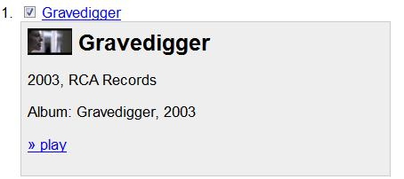
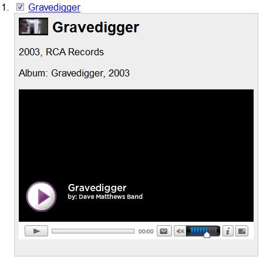

#设计模式之代理模式

##介绍

代理，顾名思义就是帮助别人做事，GoF 对代理模式的定义如下：

代理模式（Proxy），为其他对象提供一种代理以控制对这个对象的访问。

代理模式使得代理对象控制具体对象的引用。代理几乎可以是任何对象：文件，资源，内存中的对象，或者是一些难以复制的东西。

##正文

我们来举一个简单的例子，假如dudu要送酸奶小妹玫瑰花，却不知道她的联系方式或者不好意思，想委托大叔去送这些玫瑰，那大叔就是个代理（其实挺好的，可以扣几朵给媳妇），那我们如何来做呢？

```
// 先声明美女对象
var girl = function (name) {
    this.name = name;
};
// 这是dudu
var dudu = function (girl) {
    this.girl = girl;
    this.sendGift = function (gift) {
        alert("Hi " + girl.name + ", dudu送你一个礼物：" + gift);
    }
};
// 大叔是代理
var proxyTom = function (girl) {
    this.girl = girl;
    this.sendGift = function (gift) {
        (new dudu(girl)).sendGift(gift); // 替dudu送花咯
    }
};
```

调用方式就非常简单了：

```
var proxy = new proxyTom(new girl("酸奶小妹"));
proxy.sendGift("999朵玫瑰");
```

##实战一把

通过上面的代码，相信大家对代理模式已经非常清楚了，我们来实战下：我们有一个简单的播放列表，需要在点击单个连接（或者全选）的时候在该连接下方显示视频曲介绍以及 play 按钮，点击 play 按钮的时候播放视频，列表结构如下：

```
<h1>Dave Matthews vids</h1>
<p><span id="toggle-all">全选/反选</span></p>
<ol id="vids">
  <li><input type="checkbox" checked><a href="http://new.music.yahoo.com/videos/--2158073">Gravedigger</a></li>
  <li><input type="checkbox" checked><a href="http://new.music.yahoo.com/videos/--4472739">Save Me</a></li>
  <li><input type="checkbox" checked><a href="http://new.music.yahoo.com/videos/--45286339">Crush</a></li>
  <li><input type="checkbox" checked><a href="http://new.music.yahoo.com/videos/--2144530">Don't Drink The Water</a></li>
  <li><input type="checkbox" checked><a href="http://new.music.yahoo.com/videos/--217241800">Funny the Way It Is</a></li>
  <li><input type="checkbox" checked><a href="http://new.music.yahoo.com/videos/--2144532">What Would You Say</a>
</li>
</ol>
```

我们先来分析如下，首先我们不仅要监控 a 连接的点击事件，还要监控“全选/反选”的点击事件，然后请求服务器查询视频信息，组装 HTML 信息显示在 li 元素的最后位置上，效果如下：



然后再监控play连接的点击事件，点击以后开始播放，效果如下：



好了，开始，没有 jQuery，我们自定义一个选择器：

```
var $ = function (id) {
    return document.getElementById(id);
};
```

由于 Yahoo 的 json 服务提供了 callback 参数，所以我们传入我们自定义的 callback 以便来接受数据，具体查询字符串拼装代码如下：

```
var http = {
    makeRequest: function (ids, callback) {
        var url = 'http://query.yahooapis.com/v1/public/yql?q=',
            sql = 'select * from music.video.id where ids IN ("%ID%")',
            format = "format=json",
            handler = "callback=" + callback,
            script = document.createElement('script');
            sql = sql.replace('%ID%', ids.join('","'));
            sql = encodeURIComponent(sql);
            url += sql + '&' + format + '&' + handler;
            script.src = url;
        document.body.appendChild(script);
    }
};
```

代理对象如下：

```
var proxy = {
    ids: [],
    delay: 50,
    timeout: null,
    callback: null,
    context: null,
    // 设置请求的id和callback以便在播放的时候触发回调
    makeRequest: function (id, callback, context) {
        // 添加到队列dd to the queue
        this.ids.push(id);
        this.callback = callback;
        this.context = context;
        // 设置timeout
        if (!this.timeout) {
            this.timeout = setTimeout(function () {
                proxy.flush();
            }, this.delay);
        }
    },
    // 触发请求，使用代理职责调用了http.makeRequest
    flush: function () {
        // proxy.handler为请求yahoo时的callback
        http.makeRequest(this.ids, 'proxy.handler'); 
        // 请求数据以后，紧接着执行proxy.handler方法（里面有另一个设置的callback)
        // 清楚timeout和队列
        this.timeout = null;
        this.ids = [];
    },
    handler: function (data) {
        var i, max;
        // 单个视频的callback调用
        if (parseInt(data.query.count, 10) === 1) {
            proxy.callback.call(proxy.context, data.query.results.Video);
            return;
        }
        // 多个视频的callback调用
        for (i = 0, max = data.query.results.Video.length; i < max; i += 1) {
            proxy.callback.call(proxy.context, data.query.results.Video[i]);
        }
    }
};
```

视频处理模块主要有 3 种子功能：获取信息、展示信息、播放视频：

```
var videos = {
    // 初始化播放器代码，开始播放
    getPlayer: function (id) {
        return '' +
            '<object width="400" height="255" id="uvp_fop" allowFullScreen="true">' +
            '<param name="movie" value="http://d.yimg.com/m/up/fop/embedflv/swf/fop.swf"\/>' +
            '<param name="flashVars" value="id=v' + id + '&amp;eID=1301797&amp;lang=us&amp;enableFullScreen=0&amp;shareEnable=1"\/>' +
            '<param name="wmode" value="transparent"\/>' +
            '<embed ' +
            'height="255" ' +
            'width="400" ' +
            'id="uvp_fop" ' +
            'allowFullScreen="true" ' +
            'src="http://d.yimg.com/m/up/fop/embedflv/swf/fop.swf" ' +
            'type="application/x-shockwave-flash" ' +
            'flashvars="id=v' + id + '&amp;eID=1301797&amp;lang=us&amp;ympsc=4195329&amp;enableFullScreen=1&amp;shareEnable=1"' +
            '\/>' +
            '<\/object>';
                },
    // 拼接信息显示内容，然后在append到li的底部里显示
    updateList: function (data) {
        var id,
            html = '',
            info;
        if (data.query) {
            data = data.query.results.Video;
        }
        id = data.id;
        html += '';
        html += '<h2>' + data.title + '<\/h2>';
        html += '<p>' + data.copyrightYear + ', ' + data.label + '<\/p>';
        if (data.Album) {
            html += '<p>Album: ' + data.Album.Release.title + ', ' + data.Album.Release.releaseYear + '<br \/>';
        }
        html += '<p><a class="play" href="http://new.music.yahoo.com/videos/--' + id + '">&raquo; play<\/a><\/p>';
        info = document.createElement('div');
        info.id = "info" + id;
        info.innerHTML = html;
        $('v' + id).appendChild(info);
    },
    // 获取信息并显示
    getInfo: function (id) {
        var info = $('info' + id);
        if (!info) {
            proxy.makeRequest(id, videos.updateList, videos); //执行代理职责，并传入videos.updateList回调函数
            return;
        }
        if (info.style.display === "none") {
            info.style.display = '';
        } else {
            info.style.display = 'none';
        }
    }
};
```

现在可以处理点击事件的代码了，由于有很多 a 连接，如果每个连接都绑定事件的话，显然性能会有问题，所以我们将事件绑定在<ol>元素上，然后检测点击的是否是a连接，如果是说明我们点击的是视频地址，然后就可以播放了：

```
$('vids').onclick = function (e) {
    var src, id;
    e = e || window.event;
    src = e.target || e.srcElement;
    // 不是连接的话就不继续处理了
    if (src.nodeName.toUpperCase() !== "A") {
        return;
    }
    //停止冒泡
    if (typeof e.preventDefault === "function") {
        e.preventDefault();
    }
    e.returnValue = false;
    id = src.href.split('--')[1];
    //如果点击的是已经生产的视频信息区域的连接play，就开始播放
    // 然后return不继续了
    if (src.className === "play") {
        src.parentNode.innerHTML = videos.getPlayer(id);
        return;
    }
    src.parentNode.id = "v" + id;
    videos.getInfo(id); // 这个才是第一次点击的时候显示视频信息的处理代码
};
```

全选反选的代码大同小异，我们就不解释了：

```
$('toggle-all').onclick = function (e) {
    var hrefs, i, max, id;
    hrefs = $('vids').getElementsByTagName('a');
    for (i = 0, max = hrefs.length; i < max; i += 1) {
        // 忽略play连接
        if (hrefs[i].className === "play") {
            continue;
        }
        // 忽略没有选择的项
        if (!hrefs[i].parentNode.firstChild.checked) {
            continue;
        }
        id = hrefs[i].href.split('--')[1];
        hrefs[i].parentNode.id = "v" + id;
        videos.getInfo(id);
    }
};
```

##总结

代理模式一般适用于如下场合：


1. **远程代理**，也就是为了一个对象在不同的地址空间提供局部代表，这样可以隐藏一个对象存在于不同地址空间的事实，就像 web service 里的代理类一样。
2. **虚拟代理**，根据需要创建开销很大的对象，通过它来存放实例化需要很长时间的真实对象，比如浏览器的渲染的时候先显示问题，而图片可以慢慢显示（就是通过虚拟代理代替了真实的图片，此时虚拟代理保存了真实图片的路径和尺寸。
3. **安全代理**，用来控制真实对象访问时的权限，一般用于对象应该有不同的访问权限。
4. **智能指引**，只当调用真实的对象时，代理处理另外一些事情。例如 C#里的垃圾回收，使用对象的时候会有引用次数，如果对象没有引用了，GC 就可以回收它了。
参考：《大话设计模式》

##同步与推荐

深入理解 JavaScript 系列文章，包括了原创，翻译，转载等各类型的文章，如果对你有用，请推荐支持一把，给大叔写作的动力。